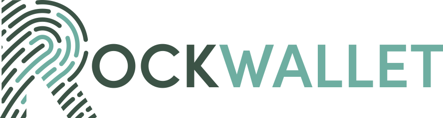

[](https://rockwallet.com/)

<div align="center">
  <a href="https://apps.apple.com/us/app/rockwallet/id1595167194">
  </a>
</div>

Rockwallet is the best way to get started with bitcoin.
Our simple, streamlined design is easy for beginners, yet powerful enough for experienced users.

### Cutting-edge security

**Rockwallet** utilizes the latest mobile security features to protect users from malware, browser security holes, and even physical theft.
On Android The user’s private key is encrypted using the Android Keystore, inaccessible to anyone other than the user.
On iOS the user’s private key is stored in the device keychain, secured by Secure Enclave, inaccessible to anyone other than the user.
Users are also able to backup their wallet using iCloud Keychain to store an encrypted backup of their recovery phrase.
The backup is encrypted with the BRD app PIN.

### Designed with New Users in Mind

Simplicity and ease-of-use is **Rockwallet**'s core design principle. A simple recovery phrase (which we call a recovery key) is all that is needed to restore the user's wallet if they ever lose or replace their device. **Rockwallet** is [deterministic](https://github.com/bitcoin/bips/blob/master/bip-0032.mediawiki), which means the user's balance and transaction history can be recovered just from the recovery key.

### Features

- Supports wallets for Bitcoin, Bitcoin Cash, Ethereum and ERC-20 tokens, Ripple, Hedera, Tezos
- Single recovery key is all that's needed to backup your wallet
- Private keys never leave your device and are end-to-end encrypted when using iCloud backup
- Save a memo for each transaction (off-chain)

### Bitcoin Specific Features
- Supports importing [password protected](https://github.com/bitcoin/bips/blob/master/bip-0038.mediawiki) paper wallets
- Supports [JSON payment protocol](https://bitpay.com/docs/payment-protocol)
- Supports SegWit and bech32 addresses

## About brd-mobile

This repository is the Rockwallet Mobile repository for iOS, powered by a collection of Kotlin Multiplatform Mobile ([KMM](https://kotlinlang.org/lp/mobile/)) modules codenamed Cosmos.

Cosmos breaks down into many modules that are bundled to produce a final Jar/AAR and Framework for mobile projects.
Each module contains only code related to a single feature, helping keep the project organized and improve incremental build times.

## Modules

The following modules are available, click on the name to learn more.

- [`cosmos-core`](/cosmos-core) Internal shared utilities for all other modules to leverage.
- [`cosmos-brd-api-client`](/cosmos-brd-api-client) A Hydra compatible API wrapper for Kotlin and Swift.
- [`cosmos-bundled`](/cosmos-bundled) Depends on all other modules to produce final dependency artifacts.


## Development

### Prerequisites

- Install [OpenJDK 8+](https://adoptopenjdk.net/installation.html?variant=openjdk8)
- Download [Intellij IDEA](https://www.jetbrains.com/idea/) or [Android Studio](https://developer.android.com/studio/)

### Setup

## Advanced Setup

## Gradle Tasks

Here is a list of the most useful gradle tasks available.
For a comprehensive list of tasks run `./gradlew tasks` or `./gradlew :<module-name>:tasks`.


Build
```shell
# Build, test, and package all modules
./gradlew build
# Run all quality checks
./gradlew check
# Assemble BRD Android
./gradlew brd-android:app:assemble
```

Tests
```shell
# Run all tests, in all modules
./gradlew allTest
# Run all tests, in a single module
./gradlew :cosmos-brd-api-client:allTest
# Run Jvm tests
./gradlew jvmTest
# Run iOS Simulator tests
./gradlew iosX64Test
```

Packaging
```shell
# Package Jvm artifacts
./gradlew jvmJar
# Package iOS Frameworks (Simulator)
./gradlew linkDebugFrameworkIosX64 linkReleaseFrameworkIosX64
# Package iOS Frameworks (Device)
./gradlew linkDebugFrameworkIosArm64 linkReleaseFrameworkIosArm64
```

### WARNING:

***Installation on jailbroken devices is strongly discouraged.***

Any jailbreak app can grant itself access to every other app's keychain data. This means it can access your wallet and steal your bitcoin by self-signing as described [here](http://www.saurik.com/id/8) and including `<key>application-identifier</key><string>*</string>` in its .entitlements file.

---

**Rockwallet** is open source and available under the terms of the MIT license.

Source code is available at https://github.com/rockwalletcode
